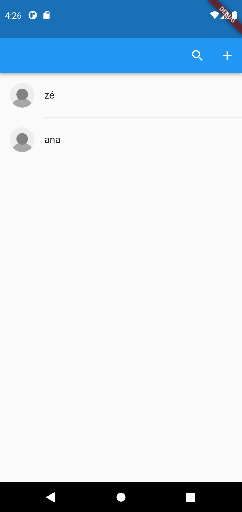
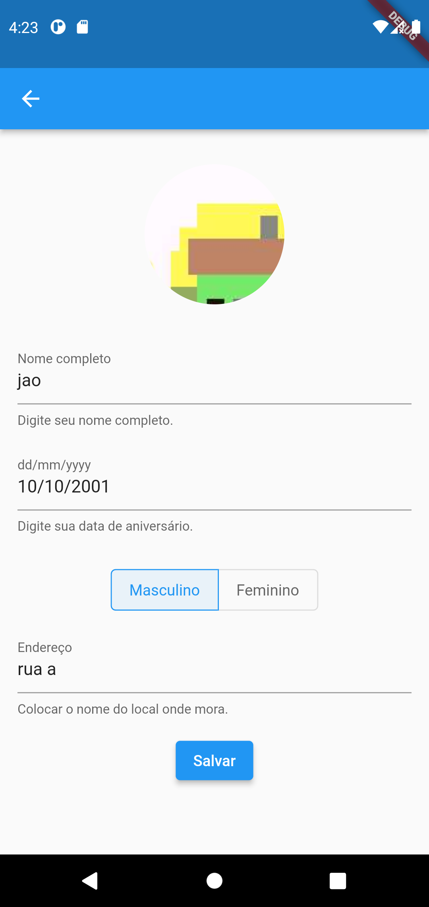
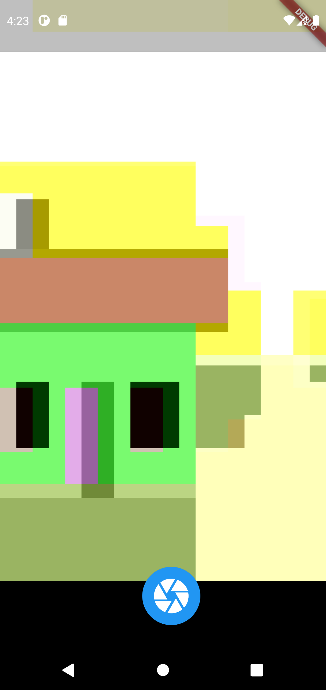

# Flutter training - my projects

My folder for small projects to learn and create app with Flutter framework.

## Follow my tracks

In this app, you can create, edit, delete tracks. Selecting a track, it's showing in the main map.

This project uses bloc pattern and google maps package.

See inside the project's README for more details:
https://github.com/jttuboi/flutter_training_my_projects/tree/main/follow_my_tracks

<table>
<tr>
<td>
Maps page
</td>
<td>
Track page
</td>
<td>
Add/Edit track page
</td>
</tr>
<tr>
<td>

</td>
<td>

</td>
<td>

</td>
</tr>
</table>

## Person form

In this app, you can register your data (name, birthday, gender, address and picture) in the Firebase.

This project uses bloc pattern, camera and firebase(cloud firestore for data and storage for picture).

See inside the project's README for more details:
https://github.com/jttuboi/flutter_training_my_projects/tree/main/person_form

<table>
<tr>
<td>
Person list
</td>
<td>
Person search
</td>
</tr>
<tr>
<td>

</td>
<td>

</td>
</tr>

<tr>
<td>
Add/Edit person
</td>
<td>
Camera
</td>
<td>
Crop image (package)
</td>
</tr>
<tr>
<td>

</td>
<td>

</td>
<td>

</td>
</tr>
</table>

## Tic tac toe

This is a tic tac toe game.

This project uses a MVC architecture pattern, unit test and integration test.

See inside the project's README for more details:
https://github.com/jttuboi/flutter_training_my_projects/tree/main/tic_tac_toe_mvc

<table>
<tr>
<td>
Begin of the game
</td>
<td>
Middle of the game
</td>
<td>
Finish of the game
</td>
</tr>
<tr>
<td>

</td>
<td>

</td>
<td>

</td>
</tr>
</table>

## Todos

This is a simple todo list based on https://bloclibrary.dev/#/fluttertodostutorial. I only used the GIF to reference and build the app using what I learnt. In other project, I copy to look the diferences of them.

This project uses Bloc pattern.

See inside the project's README for more details:
https://github.com/jttuboi/flutter_training_my_projects/tree/main/todos_bloc

<table>
<tr>
<td>
Todos tab
</td>
<td>
Stats tab
</td>
</tr>
<tr>
<td>

</td>
<td>

</td>
</tr>
<tr>
<td>
Show todo details
</td>
<td>
Add/Edit todo
</td>
</tr>
<tr>
<td>

</td>
<td>

</td>
</tr>
</table>